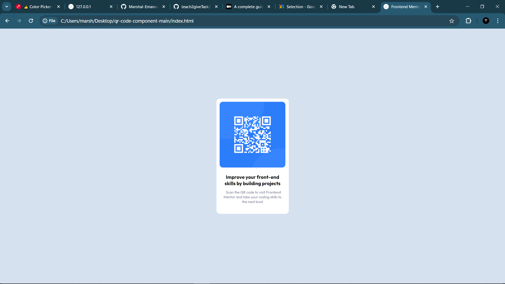

# Frontend Mentor - QR code component solution

This is a solution to the [QR code component challenge on Frontend Mentor](https://www.frontendmentor.io/challenges/qr-code-component-iux_sIO_H).

## Table of contents

- [Overview](#overview)
  - [Screenshot](#screenshot)
  - [Links](#links)
  - [Built with](#built-with)
  - [What I learned](#what-i-learned)

- [Author](#author)

## Overview
This project is a front-end coding challenge provided by Frontend Mentor. The goal is to build a QR code component based on the given design files.

### Screenshot

...

### Links

- Solution URL: [Task2_QR_Code](https://github.com/Marshal-Emanuel/teach2giveTask2_QCode)
- Live Site URL: [Live page](https://marshal-emanuel.github.io/teach2giveTask2_QCode/)

## My process

### Built with

- Semantic HTML5 markup
- Vannila CSS

## Author
- : [Marshal-Emanuel](https://github.com/Marshal-Emanuel)